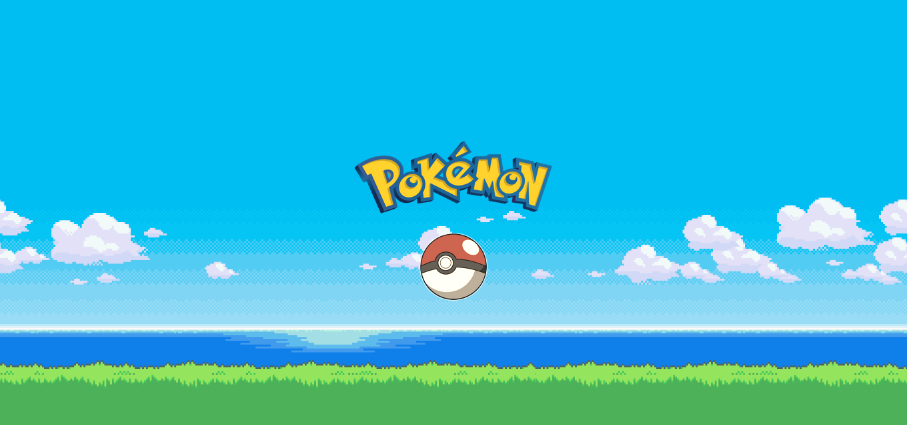
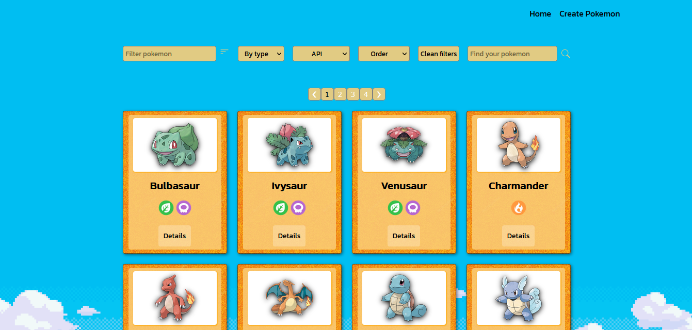

Desarrollo de una página web utilizando React para el FrontEnd y Redux como state management. Todos los componentes fueron desarrollados con CSS sin uso de librerías externas.  
La página consume datos de una API (“pokeapi”) a través de un Back End desarrollado en Node.JS utilizando Express, agregando nuevas funcionalidades a la API original.  
Algunos features del proyecto: Cache de búsquedas, ordenamientos y filtros, formulario controlado para creación de nuevos pokemons, etc.

